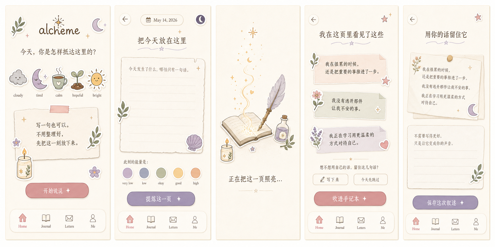
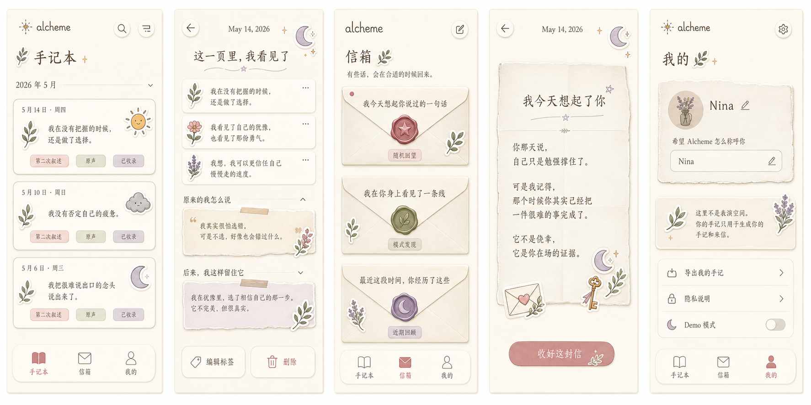
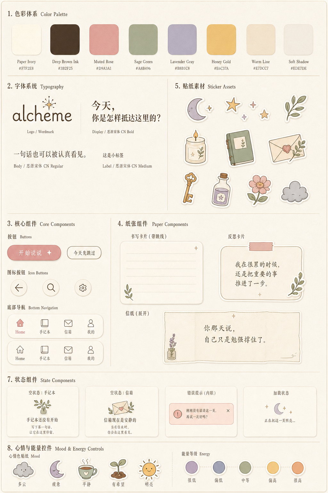

# Alcheme 前端 UI 设计文档

版本：v0.1  
日期：2026-05-14  
适用范围：Alcheme v1.3.0 Demo 前端开发  
目标目录：`D:\Projects\alcheme_new\alcheme_new_dev\ui`

---

## 1. 设计资料索引

本目录包含 Alcheme 前端开发所需的 UI 设计说明与参考图片。

### 1.1 设计图

| 文件 | 内容 | 用途 |
|---|---|---|
| `images/alcheme-ui-reference.png` | 原始视觉参考图 | 定义手账、贴纸、纸张、柔和装饰的整体气质 |
| `../public/reference/alcheme-ui-01-core-flow.png` | 主流程界面设计图 | Home、输入、提炼中、提炼结果、第二次叙述 |
| `../public/reference/alcheme-ui-02-journal-letters-me.png` | 扩展页面设计图 | 手记本、手记详情、信箱、来信详情、我的 |
| `../public/reference/alcheme-ui-03-design-system.png` | 设计系统图 | 色彩、字体、按钮、纸张组件、贴纸资产、状态组件 |

### 1.2 图片预览







---

## 2. 产品 UI 定位

Alcheme 不是效率工具，不是打卡工具，也不是心理治疗工具。前端界面要服务于一个核心体验：

> 用户说出一段还没整理好的话，Alcheme 把其中被忽视的事实提炼成用户能够相信的第一人称叙事，并在之后以手记和来信的形式陪她重新看见自己。

界面应该像一本私人的手记本，而不是一个 AI 聊天应用。

### 2.1 设计方向

| 项 | 方向 |
|---|---|
| Direction | 温柔、成熟、手账式私人炼金空间 |
| Density | 舒展、低压、移动端优先 |
| Surface | 纸张、手记本、信封、贴纸化装饰 |
| Type mood | 细腻、文学、安静 |
| Motion | 像纸页、星光、字迹自然出现 |
| Primary feeling | 被看见，而不是被管理 |

### 2.2 关键词

应该接近：

- 私密
- 柔软
- 手作
- 有记忆
- 有仪式感
- 克制
- 成年人的温柔
- 像一位安静的见证者

应该避免：

- 可爱过头
- 儿童化
- 游戏化
- 心理诊断感
- 效率工具感
- AI 聊天窗口感
- 数据看板感
- 社区/分享/表演感

---

## 3. 开发原则

### 3.1 不要把 UI 组件切成 PNG

以下元素必须用代码实现，不应当切图：

- 按钮
- 卡片
- 输入框
- textarea
- 底部导航
- 手记列表
- 信箱列表
- modal / sheet / toast
- loading / empty / error / success 状态
- 情绪选择器
- 能量选择器
- 页面布局

原因：

- 需要响应式适配不同屏幕。
- 文案需要可编辑。
- 控件需要真实可点击、可聚焦、可输入。
- 需要无障碍支持。
- 后续改色、改间距、改状态会更容易。

### 3.2 可以单独生成或拆出的视觉资产

以下元素可以作为透明背景 PNG / SVG / WebP 引入：

- 月亮贴纸
- 星星贴纸
- 叶子
- 蜡烛
- 小书
- 信封
- 钥匙
- 药水瓶
- 小花
- 云朵
- 纸张纹理
- 胶带纹理
- 轻微颗粒/噪点纹理

第一版开发可以先用 CSS、lucide-react 图标、简单 SVG 占位，后续再替换成更完整的贴纸资产。

### 3.3 移动优先

Alcheme 第一版是手机端 Web App。桌面端不需要展开成传统 Dashboard，建议将 App 画布居中展示。

| 视口 | 布局 |
|---|---|
| 375px | 单列移动端主布局 |
| 768px | 中央手机画布，周围保留浅纸纹背景 |
| 1280px | 中央 390-430px App 容器，不强行扩展信息密度 |

---

## 4. 信息架构

底部导航保留四个主入口：

| Tab | 中文名 | 任务 | 气质 |
|---|---|---|---|
| Home | 说说 | 当前输入、第一次倾诉 | 入口轻、压力低 |
| Journal | 手记本 | 回看 AI 提炼后的“我……” | 一本慢慢变厚的私人书 |
| Letters | 信箱 | 不期而遇的来信 | 有记忆的见证者 |
| Me | 我的 | 隐私、偏好、导出 | 安静可信 |

### 4.1 主流程

```text
Home 选择状态
→ 说说输入
→ 提炼生成中
→ AI 提炼结果
→ 第二次叙述，可跳过
→ 保存成功
→ 手记详情
```

### 4.2 回看流程

```text
Journal
→ 手记列表
→ 手记详情
→ 查看原始输入 / 第二次叙述
```

### 4.3 来信流程

```text
Letters
→ 发现未读信
→ 打开信件
→ 阅读第二人称来信
→ 收好这封信
```

---

## 5. 页面设计说明

### 5.1 Home / 说说入口

目标：让用户愿意开始说，而不是觉得自己要完成任务。

结构：

```text
顶部：Alcheme 品牌名 + 月亮/星星/叶子装饰
主问句：今天，你是怎样抵达这里的？
情绪贴纸：cloudy / tired / calm / hopeful / bright
纸张卡片：写一句也可以。不用整理好，先把这一刻放下来。
主按钮：开始说说 ✦
底部导航
```

建议文案：

- `今天，你是怎样抵达这里的？`
- `写一句也可以。`
- `不用整理好，先把这一刻放下来。`
- `开始说说 ✦`

设计注意：

- 不出现连续记录天数。
- 不出现今日任务。
- 不出现完成度。
- 情绪选择是温柔入口，不是心理测评。

### 5.2 Write / 倾诉输入页

目标：提供一个低压力倾诉空间。

结构：

```text
顶部：返回 + 日期
标题：把今天放在这里
纸张 textarea：今天发生了什么，哪怕只有一句话。
能量选择：very low / low / okay / good / high
主按钮：提炼这一页 ✦
```

建议文案：

- `把今天放在这里`
- `今天发生了什么，哪怕只有一句话。`
- `提炼这一页 ✦`

输入状态：

| 状态 | 设计 |
|---|---|
| 初始 | 纸页空白，提示轻柔 |
| 输入中 | 不强调字数，不制造压力 |
| 内容过少 | 内联提示，不责备 |
| 提交中 | 按钮 disabled，显示轻微星光或笔迹动画 |
| 失败 | 内联错误，可重试 |

错误文案建议：

- `刚刚没有读清这一页。再试一次好吗？`
- `再多给我一点线索，好让我更认真地看见你。`

### 5.3 Extracting / 提炼中

目标：让等待过程像“被照亮”，而不是普通 loading。

视觉：

- 炼金笔在纸页上写字。
- 星光沿纸张边缘浮现。
- 字迹从浅到深淡入。

文案：

- `正在把这一页照亮…`

注意：

- 不使用重型 spinner。
- 不做科技感进度条。
- 尊重 `prefers-reduced-motion`。

### 5.4 Reflection Result / AI 提炼结果

这是产品的核心魔法时刻。

结构：

```text
标题：我在这页里看见了这些
副文案：它们本来就在，只是刚刚被照亮。
提炼卡片：3-8 条“我……”第一人称句子
邀请：想不想用自己的话，留住这几句话？
操作：写下来 / 今天先跳过
主按钮：收进手记本 ✦
```

示例文案：

- `我在很累的时候，还是把重要的事推进了一步。`
- `我没有逃开那件让我不安的事。`
- `我正在学习用更温柔的方式对待自己。`

设计注意：

- 手记提炼必须以第一人称“我”呈现。
- 不写成 AI 对用户的评价。
- 不使用“建议你”“你应该”。
- 不把结果做成聊天气泡。

### 5.5 Second Narration / 第二次叙述

目标：让用户把 AI 提炼过的话变成自己的声音。

结构：

```text
标题：用你的话留住它
引用区：AI 提炼内容
纸张 textarea：不需要写得更好，只是让它变成你的声音。
操作：保存这次叙述 / 今天先跳过
```

建议文案：

- `用你的话留住它`
- `不需要写得更好，只是让它变成你的声音。`
- `保存这次叙述`
- `今天先跳过`

注意：

- 第二次叙述不是必填。
- 跳过按钮必须可见且不带负面感。
- 不要使用“取消”作为主要文案。

### 5.6 Journal List / 手记本

目标：让用户感到自己正在积累一本私人书，而不是数据列表。

结构：

```text
顶部：手记本 + 搜索/筛选
月份分组：2026 年 5 月
手记卡片：日期 + 情绪 + 第一人称摘要 + 标签
底部导航
```

卡片示例：

- `我在没有把握的时候，还是做了选择。`
- `我没有否定自己的疲惫。`
- `我把很难说出口的念头说出来了。`

标签示例：

- `第二次叙述`
- `原声`
- `已收录`

空状态：

- `手记本还没有开始。`
- `第一句话，会成为第一页。`

### 5.7 Journal Detail / 手记详情

结构：

```text
顶部：返回 + 日期 + 情绪/能量
标题：这一页里，我看见了
AI 提炼内容
原来的我怎么说
原始输入
后来，我这样留住它
第二次叙述
底部操作：编辑标签 / 删除
```

信息优先级：

1. 先展示“我……”提炼内容。
2. 再展示原始输入。
3. 最后展示第二次叙述。

原因：用户首先应该看到被提炼后的自我叙事，而不是立刻回到原始的自我怀疑语境。

### 5.8 Letters List / 信箱

目标：像一个偶尔有信出现的小抽屉，而不是通知中心。

结构：

```text
顶部：信箱
提示：有些话，会在合适的时候回来。
信封卡片：标题 + 类型 + 日期 + 未读状态
底部导航
```

信件标题示例：

- `我今天想起你说过的一句话`
- `我在你身上看见了一条线`
- `最近这段时间，你经历了这些`

类型示例：

- `随机回望`
- `模式发现`
- `近期回顾`
- `悄悄变了`

未读状态：

- 使用小蜡封、星星、月亮或信封角标。
- 不使用红点数字 badge。

空状态：

- `信箱现在是安静的。`
- `这不代表没有事情发生。`

### 5.9 Letter Detail / 来信详情

来信必须使用第二人称“你”，像一个有记忆的见证者。

结构：

```text
顶部：返回 + 日期
信纸标题
信件类型贴纸
正文
底部按钮：收好这封信
```

正文示例：

```text
你那天说，自己只是勉强撑住了。
可是我记得，那个时候你其实已经把一件很难的事完成了。
它不是侥幸，它是你在场的证据。
```

注意：

- 不提供“回复 AI”。
- 不提供聊天输入框。
- 不把来信做成消息流。
- 来信是信，不是对话。

### 5.10 Me / 我的

结构：

```text
顶部：我的
用户卡片：昵称 / 希望 Alcheme 怎么称呼你
隐私说明卡片
列表入口：导出我的手记 / 隐私说明 / Demo 模式
底部导航
```

隐私文案建议：

- `这里不是表演空间。`
- `你的手记只用于生成你的手记和来信。`
- `你可以随时导出自己的内容。`

---

## 6. 设计系统

### 6.1 色彩 Token

建议先在 CSS 变量中建立这些 token，再映射到 Tailwind theme 或全局样式。

| Token | 用途 | 建议色感 |
|---|---|---|
| `--paper` | 页面底色、纸张背景 | 暖象牙白 |
| `--paper-soft` | 次级纸张、浅底卡片 | 更浅的暖白 |
| `--ink` | 主文字 | 深棕黑 |
| `--ink-muted` | 辅助文字 | 暖灰棕 |
| `--rose` | 主按钮、当前态 | 低饱和豆沙粉 |
| `--sage` | 安定、手记、植物 | 灰绿 |
| `--lavender` | 信箱、月亮、夜晚 | 灰紫 |
| `--gold` | 炼金、星光、成功反馈 | 柔和蜂蜜金 |
| `--line` | 边框、手账线 | 浅棕 |
| `--shadow` | 轻阴影 | 暖棕低透明度 |

实现原则：

- 不要在组件内到处硬编码 hex。
- 先建立 CSS token。
- 页面内所有颜色从 token 派生。
- 避免整套 UI 被单一粉色或米色淹没，需要 rose / sage / lavender / gold 的轻微平衡。

### 6.2 字体

| 场景 | 方向 |
|---|---|
| 品牌名 Alcheme | 柔和、手写感或优雅 serif |
| 中文标题 | 温柔但清晰，可偏宋体/手写感，但必须可读 |
| 中文正文 | 阅读优先，16px 左右 |
| UI 标签 | 简洁 sans，保证按钮和导航清楚 |
| 日期/辅助信息 | 13-14px，低调但可读 |

字号建议：

| 层级 | 用途 |
|---|---|
| 28-34px | 首页主问句、页面大标题 |
| 20-24px | 卡片标题、来信标题 |
| 16-18px | 手记正文、AI 提炼内容 |
| 13-14px | 日期、说明、辅助文字 |
| 11-12px | 标签、小状态 |

### 6.3 圆角与阴影

项目里卡片圆角建议控制在 8px 左右，不要做成大量大圆角泡泡。

| 元素 | 建议 |
|---|---|
| 纸张卡片 | 8px |
| 小标签 | 6-8px |
| 主按钮 | pill 可接受，但要成熟克制 |
| 贴纸 | 不规则白边，可用图片资产实现 |
| 阴影 | 极轻，模拟纸张浮起 |

### 6.4 图标与贴纸

功能性图标：

- 使用 lucide-react。
- 图标按钮要有 40x40px 以上点击区域。
- 图标仅装饰时加 `aria-hidden`。
- 无文字图标按钮必须有 `aria-label`。

装饰贴纸：

- 贴纸是陪伴，不是主要信息。
- 不要遮挡正文。
- 不要影响点击区域。
- 同一屏贴纸数量要克制。

---

## 7. 组件清单

建议优先实现以下组件：

```text
AppShell
BottomNav
PaperCard
PaperTextarea
StickerButton
MoodSticker
EnergyDots
AlchemyLoading
ReflectionCard
SecondNarrationPanel
JournalEntryCard
JournalDetailSection
LetterEnvelopeCard
LetterPaper
PrivacyNote
EmptyState
InlineError
IconButton
PrimaryButton
SecondaryButton
```

### 7.1 BottomNav

四栏：

- Home
- Journal
- Letters
- Me

注意：

- 固定底部。
- 适配 iOS safe area。
- 当前态用 `rose` 或 `lavender`，不要用高亮红。
- 点击区域至少 44px 高。

### 7.2 PaperCard

用于：

- 首页提示卡
- 输入纸张
- AI 提炼结果
- 手记详情
- 隐私说明

视觉：

- 暖白纸张底。
- 轻微边框。
- 可选纸纹背景。
- 阴影极轻。

### 7.3 ReflectionCard

用于 AI 提炼结果。

内容必须是第一人称：

```text
我……
```

不允许：

```text
你应该……
AI 认为你……
建议你……
```

### 7.4 LetterPaper

用于来信详情。

内容必须是第二人称：

```text
你……
```

注意：

- 不做聊天气泡。
- 不放回复框。
- 信件阅读完成后只能“收好这封信”或返回信箱。

---

## 8. 状态设计

每个核心页面需要有 loading、empty、error、success 状态。

| 页面 | Loading | Empty | Error | Success |
|---|---|---|---|---|
| Home | 首屏骨架 | 无需 | 初始化失败 | 可开始 |
| Write | 保存草稿/提炼中 | 空输入轻提示 | 提炼失败可重试 | 进入结果页 |
| Journal | 纸条骨架 | 空手记本 | 读取失败 | 手记列表 |
| Letters | 信封骨架 | 信箱安静 | 读取失败 | 信件列表 |
| Me | 设置骨架 | 默认偏好 | 保存失败 | 已保存 |

错误文案风格：

- 温柔
- 具体
- 可恢复
- 不责备用户

示例：

- `刚刚没有读清这一页。再试一次好吗？`
- `信箱暂时打不开，但信还在那里。`
- `这页还没有保存好，再给我一次机会。`

---

## 9. 动效原则

动效要像“被照亮”，不要像 SaaS loading。

| 场景 | 动效 |
|---|---|
| 页面进入 | 纸张轻微上浮，透明度 0 到 1 |
| 情绪贴纸选择 | 贴纸轻轻按下，1-2px 位移 |
| 提炼中 | 星点沿纸张边缘出现，字迹淡入 |
| 提炼结果 | “我……”卡片逐条浮现 |
| 保存成功 | 小星光扫过纸页角落 |
| 打开信件 | 信封展开，信纸上移 |

限制：

- 不使用夸张弹跳。
- 不使用礼花式奖励。
- 不用 `transition: all`。
- 必须尊重 `prefers-reduced-motion`。

---

## 10. 文案规则

### 10.1 手记

手记使用第一人称“我”。

正确：

```text
我在很累的时候，还是把重要的事推进了一步。
```

避免：

```text
你今天很努力。
AI 看见你很棒。
你应该相信自己。
```

### 10.2 来信

来信使用第二人称“你”。

正确：

```text
你那天说，自己只是勉强撑住了。
可是我记得，那个时候你其实已经把一件很难的事完成了。
```

避免：

```text
用户近期表现出明显积极变化。
系统检测到你的成长。
```

### 10.3 产品边界文案

不使用：

- 治疗
- 症状
- 诊断
- 改善心理问题
- 疗程
- 打卡
- 连续
- 等级
- 成就勋章

可以使用：

- 看见
- 留住
- 手记
- 来信
- 照亮
- 收好
- 私密
- 见证

---

## 11. 不做清单

前端实现时请主动避免：

- 不做对话式 AI 聊天。
- 不做打卡、连续天数、等级、勋章。
- 不做社区、分享、广场。
- 不做复杂心理测评。
- 不做今日任务系统。
- 不做红点通知中心。
- 不做数据看板式首页。
- 不做强压迫感的提醒。
- 不做医疗或临床心理建议。

---

## 12. Codex 开发提示词

可以将以下提示词直接交给 Codex 进行前端开发：

```text
请根据以下资料实现 Alcheme 前端 Demo：

1. 产品文档：D:\Projects\alcheme_new\Alcheme_产品项目书_v1.3.md
2. UI 设计文档：D:\Projects\alcheme_new\alcheme_new_dev\ui\UI设计文档.md
3. 设计参考图片：
   - D:\Projects\alcheme_new\alcheme_new_dev\ui\images\alcheme-ui-reference.png
   - D:\Projects\alcheme_new\alcheme_new_dev\ui\images\alcheme-ui-01-core-flow.png
   - D:\Projects\alcheme_new\alcheme_new_dev\ui\images\alcheme-ui-02-journal-letters-me.png
   - D:\Projects\alcheme_new\alcheme_new_dev\ui\images\alcheme-ui-03-design-system.png

开发要求：

- 移动优先。
- 桌面端居中展示手机 App 画布。
- 温柔、成熟、手账贴纸风。
- 不做打卡、等级、连续天数、聊天 UI。
- Home / Journal / Letters / Me 四个主导航。
- 手记使用第一人称“我”。
- 来信使用第二人称“你”。
- UI 组件用代码实现，不要把按钮、卡片、导航、输入框切成图片。
- 贴纸插画第一版可用 CSS / lucide-react / SVG 占位，后续再替换 PNG 资产。
- 建立设计 token，不要到处硬编码颜色。
- 所有可点击元素使用真实 button 或 a。
- 输入框有 label、focus ring、错误状态。
- 页面需要 loading、empty、error、success 状态。
- 动效克制，并尊重 prefers-reduced-motion。

请优先搭建完整页面结构、设计 tokens、复用组件和主流程。
```

---

## 13. 后续建议

建议开发顺序：

1. 建立 CSS tokens 与 AppShell。
2. 实现 BottomNav、PaperCard、PrimaryButton、SecondaryButton。
3. 实现 Home 和 Write 主流程。
4. 实现 ReflectionResult 和 SecondNarration。
5. 实现 JournalList / JournalDetail。
6. 实现 LettersList / LetterDetail。
7. 实现 Me / Privacy / Export 占位。
8. 增加 loading、empty、error、success 状态。
9. 统一动效。
10. 最后替换或补充贴纸 PNG / SVG 资产。

第一版可先把贴纸作为装饰性占位，不要为了贴纸资产阻塞核心流程。
